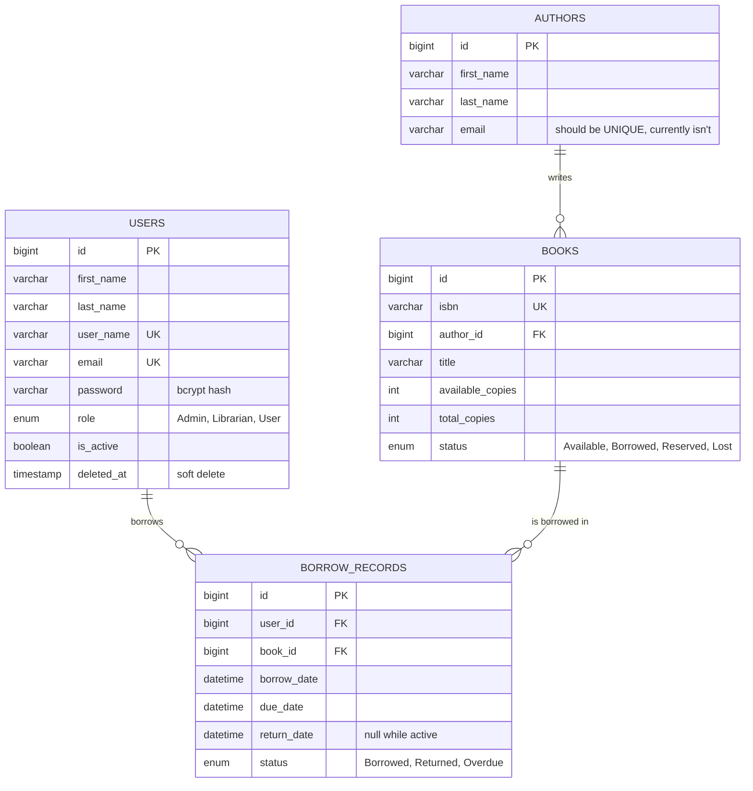
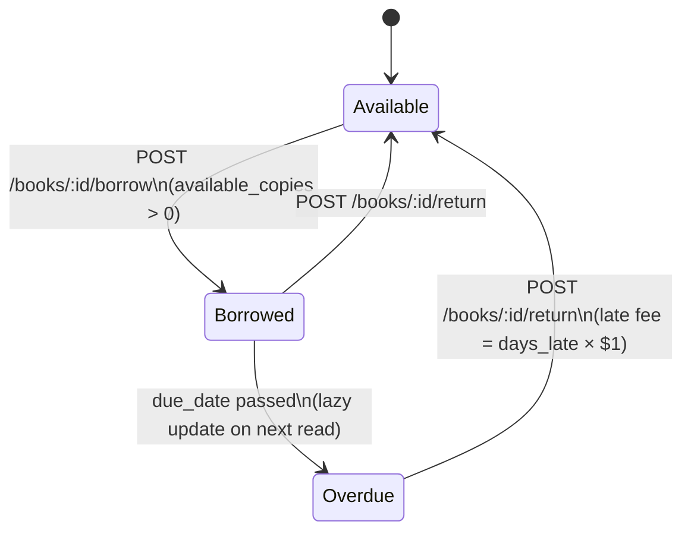

# Architecture

## Overview

LMS-API is a REST API for a library management system: books, authors, users,
and a borrow/return workflow with due dates and overdue tracking. It's a
classic layered Node.js/Express service on top of MySQL, with JWT-based auth
and role-based access control (Admin / Librarian / User).

> For known bugs and gaps in this design as currently implemented, see
> [`TODO.md`](TODO.md). This document describes the intended architecture, not
> a certification that every piece behaves as described.

## Tech stack

| Concern          | Choice                                    |
| ----------------- | ------------------------------------------ |
| Runtime           | Node.js                                    |
| Framework         | Express 5                                  |
| Database          | MySQL (via `mysql2/promise`, pooled)       |
| Auth              | JWT (`jsonwebtoken`) + `bcrypt` for hashing |
| Validation        | Zod schemas (`src/validation/schemas.js`) via a shared `validateBody` middleware |
| Cache / rate limiting | Redis (`ioredis`), in-process fallback if `REDIS_URL` is unset |
| Logging           | `pino`, structured, with credential redaction |
| Testing           | Jest + Supertest                           |
| Process manager   | `nodemon` in dev, plain `node` in prod     |

## Directory structure

```
LMS-API/
├── src/
│   ├── server.js                  # App entrypoint, middleware wiring, graceful shutdown
│   ├── .env                       # Real env vars (gitignored) — loaded via __dirname
│   ├── config/
│   │   ├── database.config.js     # MySQL pool, query/transaction helpers
│   │   └── auth.config.js         # JWT/password/rate-limit config, RBAC permission table
│   ├── controllers/                # Request handling, response shaping
│   ├── middlewares/                 # verifyToken, requireRole, validateBody, error handling
│   ├── models/                      # SQL queries + row → API-shape formatting
│   ├── routes/                      # Express routers, one per resource
│   ├── validation/                  # Zod request-body schemas
│   ├── jobs/                        # Scheduled jobs (overdue borrow-record sweep)
│   ├── utils/                       # logger, cache, store (Redis), mailer, tokens
│   └── Database/
│       └── library.database.sql   # Schema (quick-start; migrations/ is the source of truth going forward)
├── migrations/                      # Forward-only SQL migrations (scripts/migrate.js runs these)
├── tests/
│   ├── api/                        # Supertest suites, one per resource + integration/security
│   ├── unit/                       # Pure-function and utility unit tests
│   ├── db/test.sql                 # Test DB schema/fixtures
│   ├── helpers/                    # DBHelper: seed/clear helpers used by tests
│   └── .env.test                   # Real test env vars (gitignored)
├── docs/                            # This documentation set
└── docker/                          # Dockerfile + compose stack
```

## Layered architecture

```
┌─────────────────────────────────────────────────────────┐
│                        Client                            │
└───────────────────────┬───────────────────────────────────┘
                         │ HTTP + JWT (Authorization: Bearer <token>)
┌───────────────────────▼───────────────────────────────────┐
│  src/server.js                                             │
│  helmet → cors → json/urlencoded → optionalAuth →          │
│  roleBasedRateLimit → morgan → routers →                   │
│  notFoundHandler → errorHandler                             │
└───────────────────────┬───────────────────────────────────┘
                         │
┌───────────────────────▼───────────────────────────────────┐
│  routes/*.routes.js                                       │
│  Maps URL + method → middleware chain → controller.       │
│  Middleware chain enforces: verifyToken → requireAuth →   │
│  requireRole/requireOwnershipOrAdmin                       │
└───────────────────────┬───────────────────────────────────┘
                         │
┌───────────────────────▼───────────────────────────────────┐
│  controllers/*.controllers.js                              │
│  Parse/validate req.body & req.query, call model functions, │
│  shape the JSON response, translate errors → HTTP status.  │
└───────────────────────┬───────────────────────────────────┘
                         │
┌───────────────────────▼───────────────────────────────────┐
│  models/*.model.js                                          │
│  All SQL lives here. Parameterized queries via              │
│  config/database.config.js's `query()` helper. Also owns    │
│  row → API-object formatting (formatBook, formatUser, ...). │
└───────────────────────┬───────────────────────────────────┘
                         │
┌───────────────────────▼───────────────────────────────────┐
│  MySQL (users, authors, books, borrow_records)               │
└─────────────────────────────────────────────────────────────┘
```

Each layer only talks to the one directly below it — controllers never write
SQL, models never touch `req`/`res`. This separation is one of the project's
strongest points and is worth preserving as fixes land.

## Database schema



Notes:
- `users.deleted_at` implements a soft delete; every user query filters
  `WHERE deleted_at IS NULL`. Books, authors, and borrow records are hard-
  deleted.
- `books.author_id` is `ON DELETE SET NULL` — deleting an author orphans their
  books rather than cascading, so books survive author removal.
- `borrow_records` cascades on delete for both `user_id` and `book_id`.

## Auth & authorization model

1. **Authentication** (`verifyToken` middleware): reads `Authorization: Bearer
   <token>`, verifies the JWT signature/expiry, loads the user from the DB by
   the token's `id` claim, rejects if the user is missing or deactivated, and
   attaches the full user row to `req.user`.
2. **Authorization**, layered on top of that, three flavors depending on the
   route:
   - `requireRole([...])` — role allow-list (`requireAdmin`,
     `requireAdminOrLibrarian`, `requireUser` are pre-built instances of this).
   - `requireOwnershipOrAdmin(param)` — lets the request through if the caller
     is Admin/Librarian *or* the `:id` route param matches `req.user.id`.
   - Inline checks inside a controller (used for borrow-record ownership on
     `extend` and `getUserBorrowRecord`, since the resource owner isn't known
     until the record is loaded from the DB).
3. **`optionalAuth`** populates `req.user` if a valid token is present but
   doesn't reject the request otherwise — used on public read endpoints
   (`GET /books`, `GET /authors`) that may want to personalize the response
   later without requiring login.

`auth.config.js` also defines a declarative `rolePermissions` table
(resource → action → allowed roles) via `authUtils.hasPermission`, but as of
this writing the route-level middleware does the actual enforcement — the
permission table isn't wired into the request path yet. Treat it as a spec /
future refactor target, not active enforcement.

### Role matrix (as routed today)

| Resource       | Admin | Librarian | User (own)      | Public |
| -------------- | :---: | :-------: | :--------------: | :----: |
| Users (list)   |  ✅   |    ❌     |        ❌         |   ❌   |
| Users (single) |  ✅   |    ✅     |        ✅         |   ❌   |
| Users (create) |  ✅   |    ❌     |        ❌         |   ❌   |
| Users (update) |  ✅¹  |    ⚠️²    |        ⚠️²        |   ❌   |
| Users (delete) |  ✅   |    ❌     |        ❌         |   ❌   |
| Books (read)   |  ✅   |    ✅     |        ✅         |   ✅   |
| Books (write)  |  ✅   |    ✅     |        ❌         |   ❌   |
| Authors (read) |  ✅   |    ✅     |        ✅         |   ✅   |
| Authors (write)|  ✅   |    ✅     |        ❌         |   ❌   |
| Borrow/return  |  ✅   |    ✅     |        ✅         |   ❌   |
| Borrow records |  ✅   |    ✅     |    own only       |   ❌   |

¹ Full field set (including `role`, `is_active`, `email_verified`).
² Restricted field set — see the `PUT /users/:id` field table in
[`API.md`](API.md#users--apiusers). This is deliberate, not a bug: a
Librarian editing someone else's profile can only touch basic contact
fields, and a User editing their own profile can't touch `role`/`is_active`/
`email_verified` at all (an explicit `403` if `role` is present, silently
dropped otherwise) — the fix for the self-privilege-escalation issue that
used to exist here.

## Borrowing workflow



Business rules enforced in `bookRecords.controllers.js` / `books.model.js`:
- Max 5 concurrent borrows per user (`canUserBorrowMore`).
- A user can't borrow the same book twice while an active record exists.
- Borrowing and returning both run inside a DB transaction
  (`executeTransaction` / manual `beginTransaction`/`commit`/`rollback`) so the
  book's `available_copies` and the `borrow_records` row never drift apart.
- Overdue status is **not** computed by a background job — it's recalculated
  lazily (`updateOverdueBorrowRecords`) whenever the borrow-records list or
  overdue endpoints are hit. See Phase 7 of `TODO.md` for turning this into a
  scheduled job.

## Design decisions worth knowing

- **Soft delete for users, hard delete elsewhere.** Users are preserved for
  audit/borrow-history integrity; books/authors/borrow-records are not,
  because there's no compliance reason to keep them and it keeps queries
  simpler.
- **Formatting lives in the model layer**, not the controller. Every model
  exports a `format*` function that turns a raw DB row into the API shape
  (adds computed fields like `is_available`, `full_name`, `is_overdue`).
  Controllers never hand a raw DB row to `res.json()` — `findUserById`
  (auth-only, includes the password hash) and `findUserByIdSafe` /
  `formatUser` (safe to return) are deliberately separate functions so this
  can't happen by accident.
- **Connection pooling, not per-request connections.** All queries go through
  a single `mysql2` pool (`database.config.js`); transactions borrow a
  dedicated connection from the pool for the duration of the transaction only.
- **Redis-backed shared state, with an in-process fallback.** The token
  blacklist and role-based rate limiter (`src/utils/store.js`) use Redis when
  `REDIS_URL` is set — the Docker Compose stack always provisions it — and
  fall back to an in-process `Map` otherwise, which is fine for local dev but
  won't survive a restart or work across multiple instances.
- **Migrations are forward-only, dependency-free `.sql` files** applied by
  `scripts/migrate.js` (tracked in a `schema_migrations` table) — not a full
  framework, since the schema is small enough that a straight-line list is
  easier to reason about than one.

## Remaining known gaps

See [`TODO.md`](TODO.md) for the full, prioritized list of what's still open
(mostly P2/P3 polish at this point — e.g. OpenAPI-generated docs instead of
handwritten ones, DB connection pool tuning under real load).
